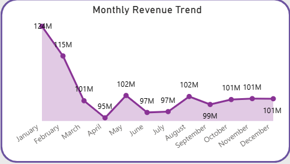
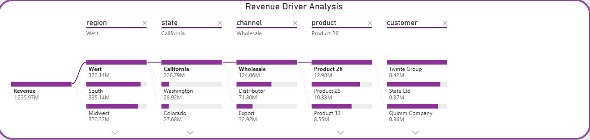

# USA-Regional-Sales-Analysis
## 🟦 Overview
This project focuses on analyzing regional sales performance across the USA using an end-to-end data analytics approach. The goal is to derive meaningful business insights and build an interactive dashboard for decision-making.

## 🟦 Dataset
The dataset contains sales transactions with details such as order date, customer, product, region, revenue, cost, and profit metrics.
Key Columns:
- Order details (order_number, order_date)
- Customer & product information
- Region & state data
- Revenue, cost, profit, and margin

## 🟦 Tools & Technologies
- Python (Pandas, Matplotlib, Seaborn)
- SQL Server (for querying & analysis)
- Power BI (for dashboard creation)

## 🟦 ##Steps Performed
1. Data Loading & Cleaning using Python
2. Exploratory Data Analysis (EDA)
3. Feature Engineering (e.g., month, year, segmentation)
4. SQL-based analysis for business queries
5. Data modeling in Power BI (Star Schema)
6. Dashboard creation with interactive visuals

## 🟦 Dashboard
The Power BI dashboard includes:
### Page 1: Sales Overview
- KPI Cards (Revenue, Profit, Orders, Margin)
- Monthly Revenue Trend
- Revenue by Channel & Region
- Top Products
- Key Business Insights

### Page 2: Advanced Insights
- Decomposition Tree (Revenue drivers)
- Revenue vs Profit Analysis
- Geographic Sales Distribution
- Profit Margin Analysis

## Dashboard Preview
### Overview Page

### Advanced Insights Page

### Key Visuals

## 🟦 Key Insights
- Wholesale channel generates ~54% of total revenue
- West region contributes ~30% of overall revenue
- January shows peak revenue trends across years
- Top products drive a significant share of total revenue

## 🟦 Results
The project provides actionable insights into regional performance, customer behavior, and product profitability, helping stakeholders make data-driven decisions.

##🟦 How to Run
1. Clone the repository
2. Open Python notebook for EDA
3. Run SQL queries in SQL Server
4. Open Power BI (.pbix) file to explore dashboard

